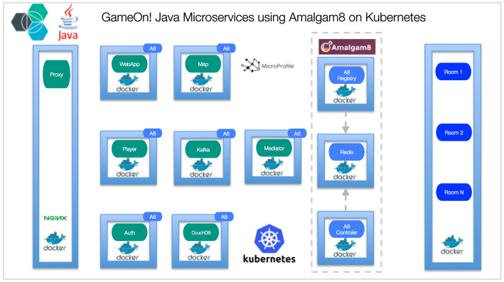
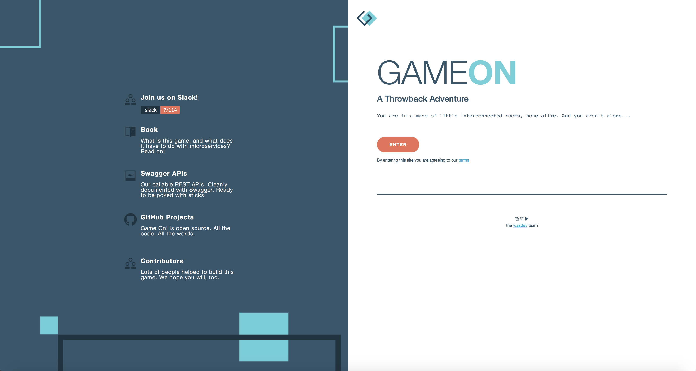
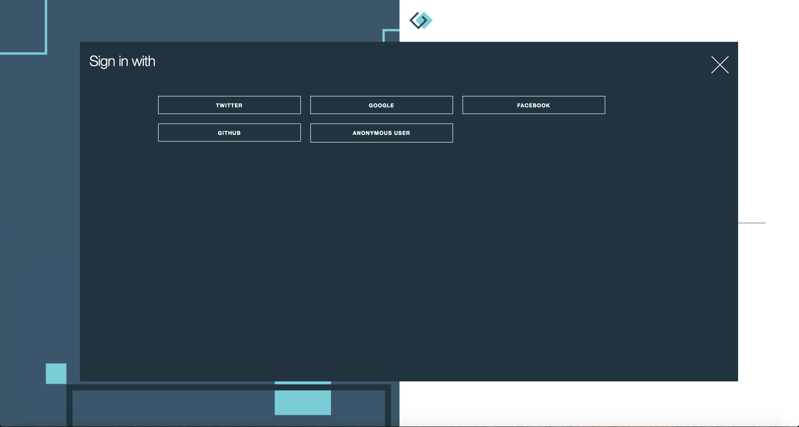
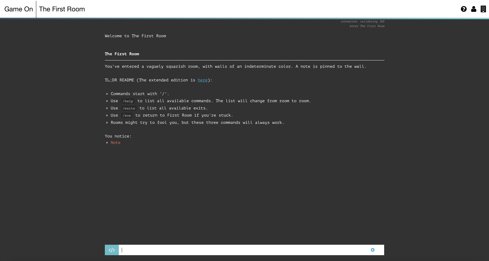
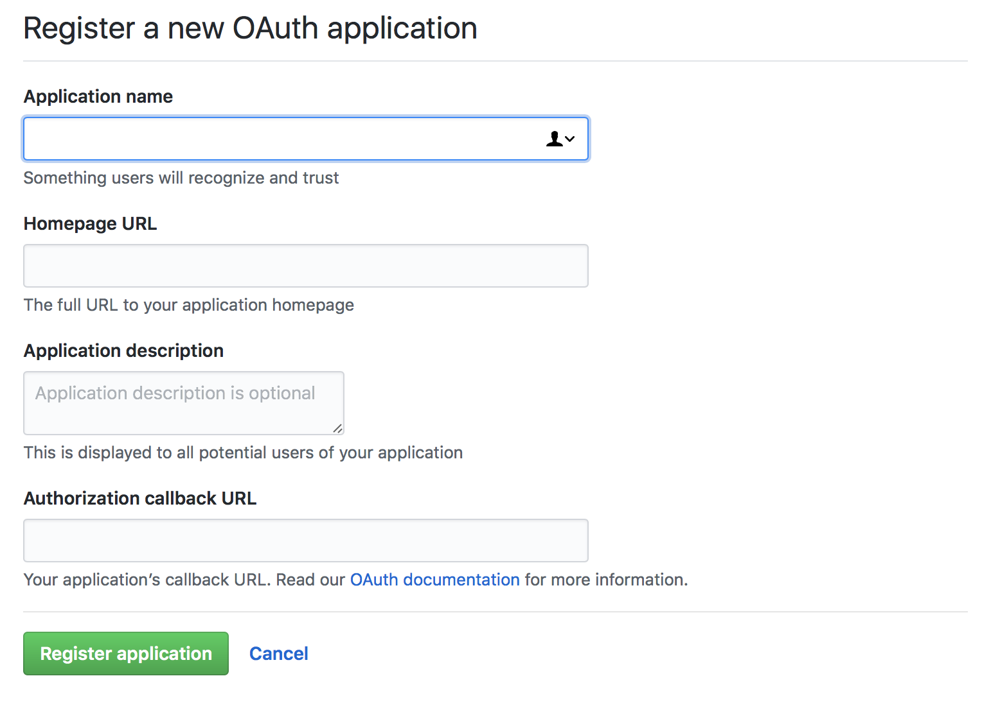
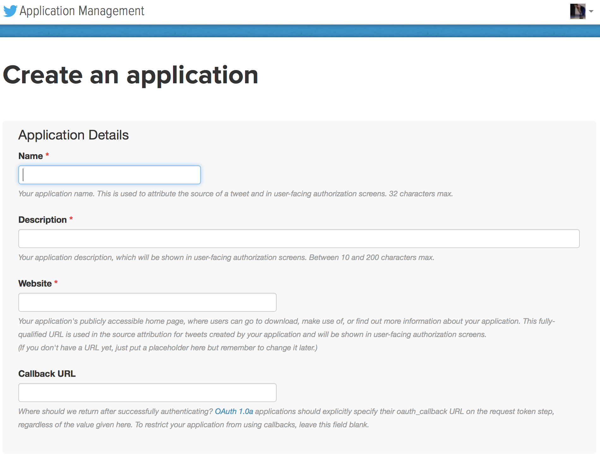
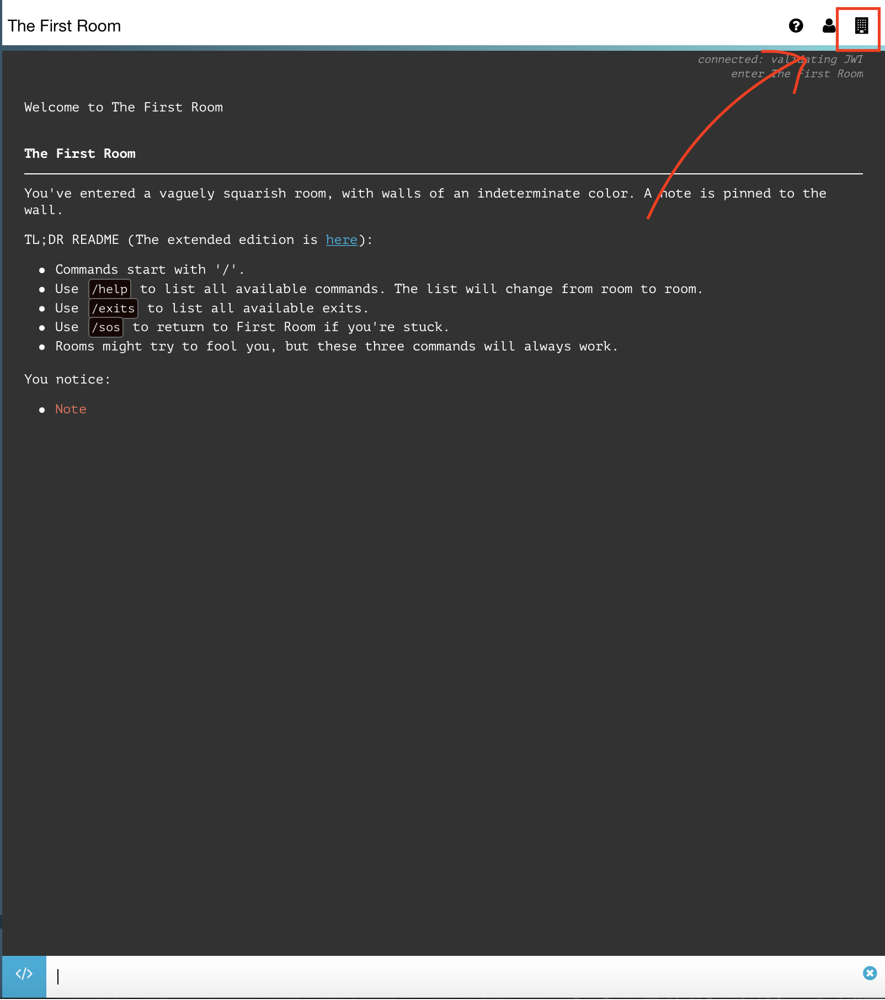
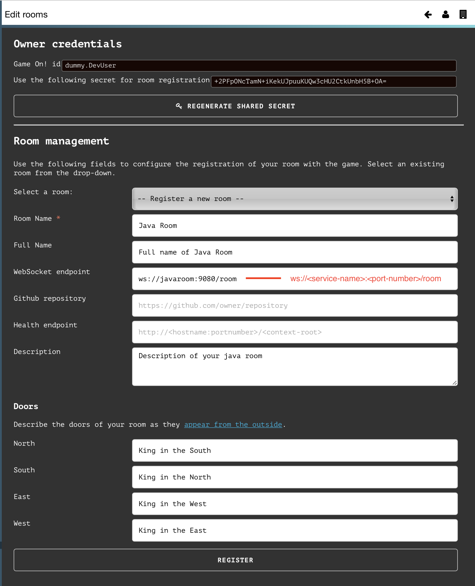

[](https://travis-ci.org/IBM/GameOn-Java-Microservices-on-Kubernetes)

# GameOn! Java Microservices on Kubernetes with polyglot ecosystem

This code demonstrates deployment of a Microservices based application [Game On!](https://book.gameontext.org) on to Kubernetes cluster which exists together with a polyglot ecosystem. Game On! is a throwback text-based adventure built to help you explore microservice architectures and related concepts. GameOn! deployment has two sets of microservice, core and platform. The core microservices are written in Java, coexisting with other polyglot microservices. In addition, there are platform services, which provide service discovery, registration and routing for different microservices. All run in in Docker containers managed by Kubernetes Cluster.



### Core MicroServices:

There are five core Java microservices, using [JAX-RS](https://en.wikipedia.org/wiki/Java_API_for_RESTful_Web_Services), [CDI](https://dzone.com/articles/cdi-di-p1) etc. part of the [MicroProfile](http://microprofile.io) spec.

- [Player](https://github.com/gameontext/gameon-player): Players are represented by the player Java microservice which provides a public API for CRUD operations, and for managing API tokens.
- [Auth](https://github.com/gameontext/gameon-auth): Java microservice to allow players to connect and identify themselves via a selected "social login"
- [Mediator](https://github.com/gameontext/gameon-mediator): The Mediator service is implemented in Java using WebSphere Liberty, and connects players to rooms over Websockets
- [Map](https://github.com/gameontext/gameon-map): The Map service is a Java EE application running on WebSphere Liberty that provides a public REST API using JAX-RS. It stores data in a NoSQL data store, either couchdb or Cloudant
- [Room](https://github.com/gameontext/gameon-room): Java based room implementation

In addition, Proxy and WebApp complete the core microservices

- [Proxy](https://github.com/gameontext/gameon-proxy): HAProxy based, and is responsible for surfacing the collection of APIs as a single facade for the entire application.
- [WebApp](https://github.com/gameontext/gameon-webapp): Webapp is a simple nginx process that serves the static files that comprise the front-end of the UI.

### Platform Services:

- [Service Discovery, Registry and Routing](https://www.amalgam8.io/): Service Registry and routing components, via which  Service Discovery and Service Proxying are implemented. In addition, there are sidecars associated with each microservice, which automatically registers the microservice with the registry.
- [Redis](): Store the addresses used by Sidecars
- [Kafka](https://kafka.apache.org): Publish/Subscribe solution used by services and the platform.

Everything would be hosted on a Kubernetes Cluster where you can access your own GameOn app from anywhere.

## Prerequisite

Create a Kubernetes cluster with either [Minikube](https://kubernetes.io/docs/getting-started-guides/minikube) for local testing, or with [IBM Bluemix Container Service](https://github.com/IBM/container-journey-template) to deploy in cloud. The code here is regularly tested against [Kubernetes Cluster from Bluemix Container Service](https://console.ng.bluemix.net/docs/containers/cs_ov.html#cs_ov) using Travis.

## Deploy to Kubernetes Cluster on Bluemix
If you want to deploy GameOn! directly to Bluemix, click on 'Deploy to Bluemix' button below to create a Bluemix DevOps service toolchain and pipeline for deploying the sample, else jump to [Steps](#steps)

> You will need to create your Kubernetes cluster first and make sure it is fully deployed in your Bluemix account.

[](https://console.ng.bluemix.net/devops/setup/deploy/?repository=https://github.com/IBM/GameOn-Java-Microservices-on-Kubernetes)

Please follow the [Toolchain instructions](https://github.com/IBM/container-journey-template/blob/master/Toolchain_Instructions.md) to complete your toolchain and pipeline.

## Steps
1. [Modify the Core services yaml files](#1-modify-the-core-services-yaml-files)
2. [Create volumes in your Cluster](#2-create-volumes-in-your-cluster)
3. [Create the Platform Services](#3-create-the-platform-services)
4. [Create the Core Services](#4-create-the-core-services)
5. [Explore your GameOn App](#5-explore-your-gameon-app)
  - 5.1 [Add Social Logins](#51-add-social-logins)
  - 5.2 [Add Rooms](#52-add-rooms)

# 1. Modify the Core services yaml files
You can also use the script provided that replaces the default values to the IP of your current cluster.
* `./scripts/replace_ip_linux.sh` for linux
* `./scripts/replace_ip_OSX.sh` for macOS

The script replaces every instance of `169.47.241.213` in the files of your [core services](#core-microservices) yaml files  and `setup.yaml` to the IP of your cluster *(found by executing `kubectl get nodes`)*.

[Other usage for the script can be found here.](/tree/master/scripts#replace_ip_-os-sh)

<details>

<summary>Or alternatively:</summary>
Get the Public IP address of your cluster.

```bash
$ kubectl get nodes
NAME             STATUS    AGE
169.xx.xxx.xxx   Ready     13d
```
Take note of the IP address. Go to the **core** folder and change the following values on the environment variables of the container **on every file** to the IP address you have. Maintain the port number.
> Example:
> ...
> value : https://169.47.241.yyy:30443/players/v1/accounts **TO ->** value : https://169.xx.xxx.xxx:30443/players/v1/accounts
> ...

```yaml
Core yaml files should look like this. Change the following env variables
    spec:
      containers:
      - image: gameontext/gameon-*
        name: *
        env:
        ...
          - name: FRONT_END_PLAYER_URL
            value : https://169.47.241.213:30443/players/v1/accounts
          - name: FRONT_END_SUCCESS_CALLBACK
            value : https://169.47.241.213:30443/#/login/callback
          - name: FRONT_END_FAIL_CALLBACK
            value : https://169.47.241.213:30443/#/game
          - name: FRONT_END_AUTH_URL
            value : https://169.47.241.213:30443/auth
        ...
          - name: PROXY_DOCKER_HOST
            value : '169.47.241.213'
        ...
```
```yaml
setup.yaml
...
spec:
  restartPolicy: Never
  containers:
  - name: setup
    image: anthonyamanse/keystore
    env:
      - name: IP
        value: 169.47.241.137
    ...
```

</details>

# 2. Create Volumes in your Cluster
You would need to create a volume for your cluster. You can use the provided yaml file. The required keystores will be stored in this volume. The volume will also be used by the [core services](#core-microservices).
```bash
$ kubectl create -f local-volume.yaml
persistent volumes "local-volume-1" created
persistent volumes "keystore-claim" created
```

You can now create the required keystores using the **setup.yaml** file. This will create a Pod and create the keystores.
```bash
$ kubectl create -f setup.yaml
```

Once it is done, the Pod will not run again. You can delete the Pod after using `kubectl delete pod setup` (optional).

If you want to confirm that the Pod has successfully imported the keystores, you can view the Pod's logs.
```bash
$ kubectl logs setup
Checking for keytool...
Checking for openssl...
Generating key stores using <Public-IP-of-your-cluster>:30443
Certificate stored in file <keystore/gameonca.crt>
Certificate was added to keystore
Certificate reply was installed in keystore
Certificate stored in file <keystore/app.pem>
MAC verified OK
Certificate was added to keystore
Entry for alias <*> successfully imported.
...
Entry for alias <**> successfully imported.
Import command completed:  104 entries successfully imported, 0 entries failed or cancelled
```

# 3. Create the Platform Services
You can now create the [Platform services](#platform-services) and deployments of the app.
```bash
$ kubectl create -f platform
OR alternatively
$ kubectl create -f platform/controller.yaml
$ kubectl create -f platform/<file-name>.yaml
...
$ kubectl create -f platform/registry.yaml
```

To check if the control plane (controller and registry) is up:
```bash
$ curl -w "%{http_code}" "<Public IP of your cluster>:31200/health" -o /dev/null
$ curl -w "%{http_code}" "<Public IP of your kubernetes>:31300/uptime" -o /dev/null
```
If both of them outputs 200, you can proceed to the next step.
> Note: It can take around 1-2 minutes for the Pods to setup completely.

# 4. Create the Core Services
Finally, you can create the **[Core services](#core-microservices)** and deployments of the app.
*(If you want to have social logins, please follow the steps [here](#a-adding-social-logins) before deploying the [core services](#core-microservices))*


```bash
$ kubectl create -f core
OR alternatively
$ kubectl create -f core/auth.yaml
$ kubectl create -f core/<file-name>.yaml
...
$ kubectl create -f core/webapp.yaml
```
To verify if the [core services](#core-microservices) has finished setting up, you would need to check the logs of the Pod of the proxy. You can get the Pod name of the proxy using **kubectl get pods**
```bash
kubectl logs proxy-***-**
```
You should look for the map, auth, mediator, player and room servers. Confirm if they are UP.
```bash
[WARNING] 094/205214 (11) : Server room/room1 is UP, reason: Layer7 check passed ...
[WARNING] 094/205445 (11) : Server auth/auth1 is UP, reason: Layer7 check passed ...
[WARNING] 094/205531 (11) : Server map/map1 is UP, reason: Layer7 check passed ...
[WARNING] 094/205531 (11) : Server mediator/mediator1 is UP, reason: Layer7 check passed ...
[WARNING] 094/205531 (11) : Server player/player1 is UP, reason: Layer7 check passed ...
```
> It can take around 5-10 minutes for these services to setup completely.

# 5. Explore your GameOn App

Now that you have successfully deployed your own app in the Bluemix Kubernetes Container Service, you can access it via its IP address and assigned Port.
> https://169.xxx.xxx.xxx:30443/
> You will need to use https on port 30443.

* You will see the homepage of your app on that address.

* Click on Enter to log in as Anonymous User(You will need to setup your own Social Login API keys if you want to use your accounts on Github,Twitter,etc..)

* The app will prompt you to enter your desired **Username** and **Favorite Color**

* **Congratulations! You now have your own GameOn app running on Bluemix! You may now wish to explore on creating new rooms and adding social logins.**
* Commands in GameOn app:
  * `/help` - lists all commands available
  * `/sos` - go back the the first room
  * `/exits` - lists all available exits
  * `/go <N,S,E,W>` - go to the room in that direction

# 5.1 Add Social Logins
You may want to add social logins so you and your friends can explore the rooms together.
To add social logins you would need to have developer accounts on the social app you want to use.

> You will need to redeploy your **[Core services](#core-microservices)** with the your own modified yaml files. The next step will show you where to add your API Keys.


## Github
You can register your application in this link: [New OAuth Application](https://github.com/settings/applications/new)

For the Homepage URL, you will need to put the IP address of your cluster and the port 30443.
> https://169.xxx.xxx.xxx:30443/#/

For the Authorization callback URL, you will need to put the IP address and the port 30443 and point to the auth service of the app.
> https://169.xxx.xxx.xxx:30443/auth/GitHubCallback

You can edit that in the GitHub later if you made a new cluster.
Now, take note of the **Client ID** and **Client Secret** of the app.
You will need to add this in the environment variables on the yaml files of your **[Core services](#core-microservices)**
```yaml
...
- name: GITHUB_APP_ID
  value : '<yourGitHubClientId>'
- name: GITHUB_APP_SECRET
  value : '<yourGitHubClientSecret>'
...
```
> The application uses the keys(name) **GITHUB_APP_ID** and **GITHUB_APP_SECRET** and must exactly match this in yaml files.

## Twitter

You can register your application with your Twitter account in this link: [Create new app](https://apps.twitter.com/app/new)


For the name field, you can put the name you want for your app.
For the Homepage URL, you will need to put the IP address of your cluster and the port 30443.
> https://169.xxx.xxx.xxx:30443/#/

For the Authorization callback URL, you will need to put the IP address and the port 30443 and point to the auth service of the app.
> https://169.xxx.xxx.xxx:30443/auth/TwitterAuth

Go to the Keys and Access Tokens section of the twitter application you just registered and take note of the **Consumer Key** and **Consumer Secret** of the app.
You will need to add this in the environment variables on the yaml files of your **[Core services](#core-microservices)**
```yaml
...
- name: TWITTER_CONSUMER_KEY
  value : '<yourGitHubClientId>'
- name: TWITTER_CONSUMER_SECRET
  value : '<yourGitHubClientSecret>'
...
```
> The application uses the keys(name) **TWITTER_CONSUMER_KEY** and **TWITTER_CONSUMER_SECRET** and must exactly match these in the core yaml files.

# 5.2 Add Rooms

You can build your own rooms by following [**this guide**](https://gameontext.gitbooks.io/gameon-gitbook/content/walkthroughs/createRoom.html) by the GameOn team. They have some sample rooms written in Java, Swift, Go, and more.

In this journey, you will deploy the **[sample room written in Java](https://github.com/gameontext/sample-room-java)**. You will deploy it in the same cluster as your GameOn App.

You can create these rooms by executing
```bash
$ kubectl create -f sample-room
```

To register the deployed rooms in the cluster, you will need to use the UI of your app.
* Click on the Registered Rooms button at the top right.


* Enter the necessary information of the room. (*Leave the Github Repo and Health Endpoint fields blank.*) Then click `Register`
> Note: In the samples, the Java Room uses port 9080, while the Swift room uses port 8080.


* You now have successfully registered your room in your Map. You can go to it directly by typing these commands in the UI: `/listmyrooms` and use the id in `/teleport <id-of-the-room>`. [Explore the game](#5-explore-your-gameon-app).

* You can learn more about the details of registering a room [**here**](https://gameontext.gitbooks.io/gameon-gitbook/content/walkthroughs/registerRoom.html).
* You can build your own room by following [GameOn's guide](https://gameontext.gitbooks.io/gameon-gitbook/content/walkthroughs/createRoom.html)

## Troubleshooting
* If you can't access the app on the browser, make sure you are using `https://` on port 30443.
* If something is wrong with a specific service, view its logs using `kubectl logs <pod-name-of-the-service>` or `kubectl logs <pod-name-of-the-service> -f` to follow the logs.
* To clean/delete your data on Persistent Volume, delete your persistent volume claim.
  * `kubectl delete pvc -l app=gameon`
  * After deleting the claim, you can delete the Persistent Volume using `kubectl delete pv local-volume-1`. This would ensure the keystores are deleted on the volume.
* To delete your platform services:
  * `kubectl delete -f platform`
* To delete your core services:
  * `kubectl delete -f core`
* To delete everything:
  * `kubectl delete svc,deploy,pvc -l app=gameon`
  * `kubectl delete pod setup`
  * `kubectl delete pv local-volume-1`

## References

* [GameOn](https://gameontext.org) - The original game on app. The journey is based on [deploying GameOn using Docker](https://book.gameontext.org/walkthroughs/local-docker.html)

## License

[Apache 2.0](http://www.apache.org/licenses/LICENSE-2.0)
