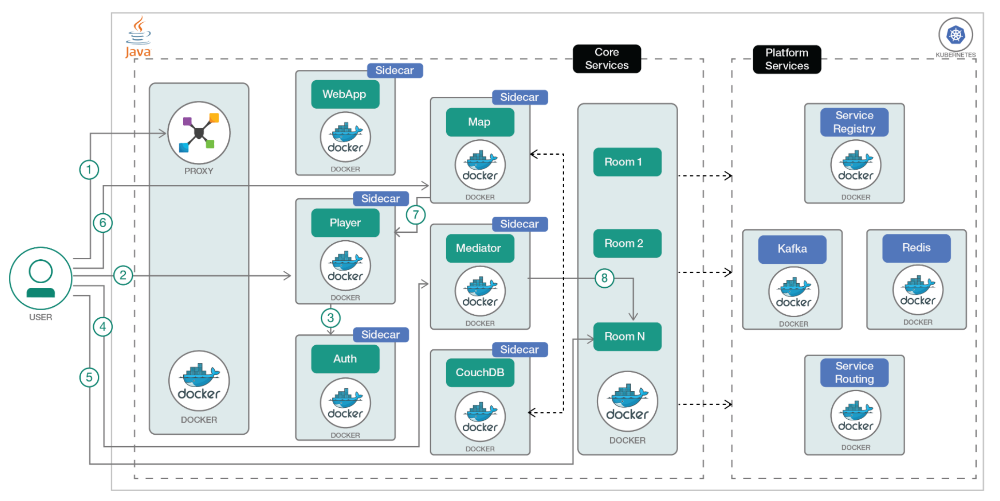

[](https://travis-ci.org/IBM/GameOn-Java-Microservices-on-Kubernetes)

# GameOn! Kubernetes 上的 Java 微服务与多语言生态系统

此代码将演示如何将一个基于微服务的应用程序 [Game On!](https://book.gameontext.org) 部署在 Kubernetes 集群上，让它与一个多语言生态系统共存。Game On! 是一个基于文本的复古冒险游戏，旨在帮助您探索微服务架构和相关概念。GameOn! 部署有两组微服务：核心和平台。核心微服务是用 Java 编写的，与其他多语言微服务共存。此外，还有一些平台服务，它们为不同微服务提供服务发现、注册和路由功能。所有微服务都在 Kubernetes 集群管理的 Docker 容器中运行。



### 核心微服务：

有 5 个核心 Java 微服务，它们使用了 [MicroProfile](http://microprofile.io) 规范的 [JAX-RS](https://en.wikipedia.org/wiki/Java_API_for_RESTful_Web_Services)、[CDI](https://dzone.com/articles/cdi-di-p1) 等部分。

- [Player](https://github.com/gameontext/gameon-player)：玩家通过 Player Java 微服务来表示，该微服务提供一个公共 API 来执行 CRUD 操作和管理 API 令牌。
- [Auth](https://github.com/gameontext/gameon-auth)：该 Java 微服务允许玩家通过选定的“社交登录”建立连接并标识自己
- [Mediator](https://github.com/gameontext/gameon-mediator)：Mediator 服务是在 Java 中使用 WebSphere Liberty 实现的，并通过 WebSocket 将玩家连接到各个房间
- [Map](https://github.com/gameontext/gameon-map)：Map 服务是一个在 WebSphere Liberty 上运行的 Java EE 应用程序，它使用 JAX-RS 提供一个公共 REST API。它将数据存储在一个 NoSQL 数据存储中：couchdb 或 Cloudant
- [Room](https://github.com/gameontext/gameon-room)：基于 Java 的房间实现

此外，Proxy 和 WebApp 为核心服务提供了补充

- [Proxy](https://github.com/gameontext/gameon-proxy)：基于 HAProxy，并负责将 API 集合呈现为整个应用程序的单一方面。
- [WebApp](https://github.com/gameontext/gameon-webapp)：Webapp 是一个简单的 nginx 流程，为组成用户界面前端的静态文件提供服务。

### 平台服务：

- [服务发现、注册表和路由](https://www.amalgam8.io/)：服务注册表和路由组件，服务发现和服务代理就是通过它们来实现的。此外，每个服务都有关联的 sidecar，sidecar 自动向注册表注册关联的微服务。
- [Redis]()：存储 Sidecar 使用的地址
- [Kafka](https://kafka.apache.org)：发布/订阅由服务和平台使用的解决方案。

## 前提条件

要本地部署游戏，可通过 GameOn 存储库中的 docker-compose [可在此处获得](https://github.com/gameontext/gameon#local-room-development) 按照说明进行操作。

要执行这里的步骤，可使用 [IBM Bluemix Container 服务](https://github.com/IBM/container-journey-template) 创建一个 Kubernetes 集群，以便在云中执行部署。这里的代码会定期使用 Travis 针对[来自 Bluemix Container 服务的 Kubernetes 集群](https://console.ng.bluemix.net/docs/containers/cs_ov.html#cs_ov) 进行测试。

## 部署到 Bluemix 上的 Kubernetes 集群中
如果想将 GameOn! 直接部署到 Bluemix，请单击下面的 Deploy to Bluemix 按钮，创建一个 Bluemix DevOps 服务工具链和管道来部署样本，否则可跳到[步骤](#steps)

> 您需要先创建 Kubernetes 集群，确保已使用您的 Bluemix 帐户完全部署它。

[](https://console.ng.bluemix.net/devops/setup/deploy/?repository=https://github.com/IBM/GameOn-Java-Microservices-on-Kubernetes)

请按照[工具链操作说明](https://github.com/IBM/container-journey-template/blob/master/Toolchain_Instructions_new.md) 完成您的工具链和管道。

## 步骤
1.[修改核心服务 yaml 文件](#1-modify-the-core-services-yaml-files)
2.[为您的集群创建一个卷](#2-create-a-volume-for-your-cluster)
3.[创建平台服务](#3-create-the-platform-services)
4.[创建核心服务](#4-create-the-core-services)
5.[探索您的 GameOn 应用程序](#5-explore-your-gameon-app)
  - 5.1 [添加社交登录](#51-add-social-logins)
  - 5.2 [添加房间](#52-add-rooms)

#### [故障排除](#troubleshooting-1)

# 1.修改 ConfigMap yaml 文件
更改 `gameon-configmap.yaml` 文件上的以下值。将 `PLACEHOLDER_IP` 更改为您的集群的公共 IP。可以从 Bluemix Container 服务的 `bx cs workers <您的集群名称>` 获取该 IP。例如：`192.168.99.100`
> 对于 minikube，可以使用 `minikube ip` 获取 IP

```yaml
FRONT_END_PLAYER_URL: https://PLACEHOLDER_IP:30443/players/v1/accounts
FRONT_END_SUCCESS_CALLBACK: https://PLACEHOLDER_IP:30443/#/login/callback
FRONT_END_FAIL_CALLBACK: https://PLACEHOLDER_IP:30443/#/game
FRONT_END_AUTH_URL: https://PLACEHOLDER_IP:30443/auth
...
PROXY_DOCKER_HOST: 'PLACEHOLDER_IP'
```

一种更改这些值的简单方法是运行  
`sed -i s#PLACEHOLDER_IP#<Public-IP-of-your-cluster#g gameon-configmap.yaml` 
或 `sed -i '' s#PLACEHOLDER_IP#<Public-IP-of-your-cluster>#g gameon-configmap.yaml`。

然后将该配置图应用到您的集群上：
```bash
$ kubectl create -f gameon-configmap.yaml
configmap "gameon-env" created
```

# 2.为您的集群创建一个卷
您需要为您的集群创建一个卷。可以使用已提供的 yaml 文件。所需的密钥库将存储在这个卷中。[核心服务](#core-microservices) 也会使用这个卷。
```bash
$ kubectl create -f local-volume.yaml
persistent volumes "local-volume-1" created
persistent volumes "keystore-claim" created
```

现在可以使用 **setup.yaml** 文件创建所需的密钥库。这将创建一个 Pod 并创建密钥库。
```bash
$ kubectl create -f setup.yaml
```

> 可以在 [containers/setup/ 文件夹](containers/setup) 中找到生成密钥库的 Dockerfile 和脚本。可以使用所提供的 Dockerfile 构建您自己的镜像。

完成后，Pod 将不会再次运行。可以在使用 `kubectl delete pod setup` 后删除该 Pod（可选）。

如果想确认该 Pod 已成功导入密钥库，可以查看该 Pod 的日志。
```bash
$ kubectl logs setup
Checking for keytool...
Checking for openssl...
Generating key stores using <Public-IP-of-your-cluster>:30443
Certificate stored in file <keystore/gameonca.crt>
Certificate was added to keystore
Certificate reply was installed in keystore
Certificate stored in file <keystore/app.pem>
MAC verified OK
Certificate was added to keystore
Entry for alias <*> successfully imported.
...
Entry for alias <**> successfully imported.
Import command completed:  104 entries successfully imported, 0 entries failed or cancelled
```

# 3.创建平台服务
现在可以创建[平台服务](#platform-services) 并部署应用程序了。
```bash
$ kubectl create -f platform
OR alternatively
$ kubectl create -f platform/controller.yaml
$ kubectl create -f platform/<file-name>.yaml
...
$ kubectl create -f platform/registry.yaml
```

检查控制面板（控制器和注册表）是否在运行：
```bash
$ curl -sw "%{http_code}" "<Public IP of your cluster>:31200/health" -o /dev/null
$ curl -sw "%{http_code}" "<Public IP of your kubernetes>:31300/uptime" -o /dev/null
```
如果二者都输出 200，那么可以继续执行下一步。
> 备注：可能要花 1-2 分钟的时间，才能完成 Pod 设置。

# 4.创建核心服务
最后，可以创建 **[核心服务](#core-microservices)** 并部署该应用程序。
*（如果想要采用社交登录，请在部署[核心服务](#core-microservices) 前执行[此处](#a-adding-social-logins) 的步骤）*


```bash
$ kubectl create -f core
OR alternatively
$ kubectl create -f core/auth.yaml
$ kubectl create -f core/<file-name>.yaml
...
$ kubectl create -f core/webapp.yaml
```
要验证[核心服务](#core-microservices) 是否已完成设置，需要检查代理的 Pod 的日志。可以使用 **kubectl get pods** 获取代理的 Pod 名称
```bash
kubectl logs proxy-***-**
```
您应该查找 map、auth、mediator、player 和 room 服务器。确认它们都在运行。
```bash
[WARNING] 094/205214 (11) : Server room/room1 is UP, reason: Layer7 check passed ...
[WARNING] 094/205445 (11) : Server auth/auth1 is UP, reason: Layer7 check passed ...
[WARNING] 094/205531 (11) : Server map/map1 is UP, reason: Layer7 check passed ...
[WARNING] 094/205531 (11) : Server mediator/mediator1 is UP, reason: Layer7 check passed ...
[WARNING] 094/205531 (11) : Server player/player1 is UP, reason: Layer7 check passed ...
```
> 可能要花 5-10 分钟的时间，才能完成这些服务的设置。

# 5.探索您的 GameOn 应用程序

现在您已成功将自己的应用程序部署到 Bluemix Kubernetes Container 服务中，可以通过它的 IP 地址和分配的端口访问它。
> https://169.xxx.xxx.xxx:30443/
> 您需要在端口 30443 上使用 https。

* 您会在该地址上看到您的应用程序的主页。

* 单击 Enter 键以匿名用户身份进行登录（如果您想使用 Github、witter 等网站上的帐户，需要设置您自己的 Social Login API 密钥）

* 该应用程序会提示您输入您想要的 **Username** 和 **Favorite Color**

* **恭喜您！您现在已经让自己的 GameOn 应用程序在 Bluemix 上运行！您现在可能希望探索如何创建新房间和添加社交登录。**
* GameOn 应用程序中的命令：
  * `/help` - 列出所有可用的命令
  * `/sos` - 返回到第一个房间
  * `/exits` - 列出所有可用的出口
  * `/go <N,S,E,W>` - 转到该方向上的房间

# 5.1 添加社交登录
您可能想要添加社交登录，以便能与好友一起探索房间。
要添加社交登录，需要在您想要使用的社交应用程序上拥有开发人员帐户。

> 您需要使用自己修改的 yaml 文件重新部署**[核心服务](#core-microservices)**。下一步将介绍在何处添加 API 密钥。


## Github
可以在这个链接中注册您的应用程序：[新的 OAuth 应用程序](https://github.com/settings/applications/new)

对于主页 URL，需要输入您的集群 IP 地址和端口 30443。
> https://169.xxx.xxx.xxx:30443/#/

对于授权回调 URL，需要输入该 IP 地址和端口 30443，并指向该应用程序的身份验证服务。
> https://169.xxx.xxx.xxx:30443/auth/GitHubCallback

如果在以后创建了一个新集群，可以在 GitHub 中编辑该信息。
现在，请记下该应用程序的 **Username** 和 **Favorite Color**。
您需要将此信息添加到您的**[核心服务](#core-microservices)** 的 yaml 文件上的环境变量中
```yaml
...
- name: GITHUB_APP_ID
  value : '<yourGitHubClientId>'
- name: GITHUB_APP_SECRET
  value : '<yourGitHubClientSecret>'
...
```
> 该应用程序使用了键（名称）**GITHUB_APP_ID** 和 **GITHUB_APP_SECRET**，而且此信息必须与 yaml 文件中的信息完全匹配。

## Twitter

可以在这个链接中使用您的 Twitter 帐户注册您的应用程序。[创建新应用程序](https://apps.twitter.com/app/new)


对于 name 字段，可以输入您希望提供给您的应用程序的名称。
对于主页 URL，需要输入您的集群 IP 地址和端口 30443。
> https://169.xxx.xxx.xxx:30443/#/

对于授权回调 URL，需要输入该 IP 地址和端口 30443，并指向该应用程序的身份验证服务。
> https://169.xxx.xxx.xxx:30443/auth/TwitterAuth

转到您刚注册的 Twitter 应用程序的 Keys and Access Tokens 部分，并记下该应用程序的 **Consumer Key** 和 **Consumer Secret**。
您需要将此信息添加到您的**[核心服务](#core-microservices)** 的 yaml 文件上的环境变量中
```yaml
...
- name: TWITTER_CONSUMER_KEY
  value : '<yourGitHubClientId>'
- name: TWITTER_CONSUMER_SECRET
  value : '<yourGitHubClientSecret>'
...
```
> 该应用程序使用键（名称）**TWITTER_CONSUMER_KEY** 和 **TWITTER_CONSUMER_SECRET**，而且此信息必须与核心 yaml 文件中的信息完全匹配。

# 5.2 添加房间

可以按照 GameOn 团队提供的[**这份指南**](https://gameontext.gitbooks.io/gameon-gitbook/content/walkthroughs/createRoom.html) 构建您自己的房间。他们拥有一些使用 Java、Swift、Go 等语言编写的样本房间。

在此次学习之旅中，将会部署**[使用 Java 编写的样本房间](https://github.com/gameontext/sample-room-java)**。将它部署在 GameOn 应用程序所在的同一个集群中。

可执行以下命令来创建这些房间
```bash
$ kubectl create -f sample-room
```

要在集群中注册所部署的房间，需要使用您的应用程序的用户界面。
* 单击右上角的 Registered Rooms 按钮。


* 输入该房间的必要信息。（*将 Github Repo 和 Health Endpoint 字段留空。*）然后单击 `Register` 
> 备注：在这些样本中，Java 房间使用了端口 9080，而 Swift 房间使用了端口 8080。


* 您现在已成功在您的地图中注册了您的房间。可以在用户界面中键入以下命令来直接访问它：`/listmyrooms` 并将 ID 用于 `/teleport <房间 ID>`。[探索游戏](#5-explore-your-gameon-app)。

* 可以在 [**这里**](https://gameontext.gitbooks.io/gameon-gitbook/content/walkthroughs/registerRoom.html) 了解注册房间的更多细节。
* 可以按照 [GameOn 的指南](https://gameontext.gitbooks.io/gameon-gitbook/content/walkthroughs/createRoom.html) 构建您自己的房间

## 故障排除
* 如果不能在浏览器上访问该应用程序，请确保在端口 30443 上使用了 `https://`。
* 如果某个特定服务存在错误，可使用 `kubectl logs <服务的 pod 名称>` 查看它的日志，或者使用 `kubectl logs <服务的 pod 名称> -f` 关注这些日志。
* 要在持久卷上清除/删除您的数据，可删除您的持久卷声明。
  * `kubectl delete pvc -l app=gameon`
  * 删除该声明后，可以使用 `kubectl delete pv local-volume-1` 删除该持久卷。这可以确保已在该卷上删除了密钥库。
* 删除您的平台服务：
  * `kubectl delete -f platform`
* 删除您的核心服务：
  * `kubectl delete -f core`
* 删除所有信息：
  * `kubectl delete svc,deploy,pvc -l app=gameon`
  * `kubectl delete pod setup`
  * `kubectl delete pv local-volume-1`
  * `kubectl delete -f gameon-configmap.yaml`

## 参考资料

* [GameOn](https://gameontext.org) - 原始的 GameOn 应用程序。此次学习之旅基于[使用 Docker 部署 GameOn](https://book.gameontext.org/walkthroughs/local-docker.html)

## 许可

[Apache 2.0](http://www.apache.org/licenses/LICENSE-2.0)
